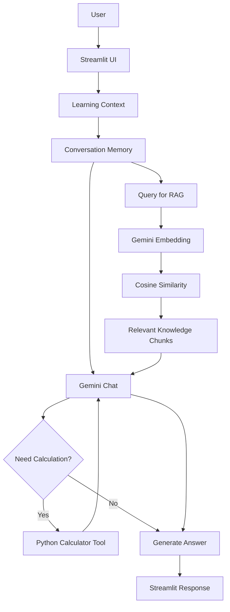

# Bapak Belajar Lagi

**AI Study Companion for Parents**

Bapak Belajar Lagi adalah chatbot edukasi berbasis Gemini API yang membantu orang tua memahami kembali pelajaran sekolah agar lebih siap mendampingi anak belajar.

## Project Links

- **Live App:** https://bapakbelajarlagi.streamlit.app/
- **GitHub Repository:** https://github.com/deayogaswara/bapak-belajar-lagi

---

Aplikasi ini tidak hanya menjawab pertanyaan. Ia menyesuaikan jawaban berdasarkan jenjang anak, mata pelajaran, dan mode penjelasan, serta menggabungkan:

- Gemini API
- Prompt engineering
- Multi-turn conversation memory
- Function calling dengan calculator tool
- Retrieval-Augmented Generation (RAG)
- Gemini embeddings
- Streamlit UI
- Fallback model handling
- Automated and manual QA

---

## Problem

Banyak orang tua ingin membantu anak belajar, tetapi:

- sudah lupa konsep pelajaran sekolah;
- memahami konsep, tetapi kesulitan menjelaskan dengan bahasa sederhana;
- khawatir memberikan penjelasan yang tidak tepat;
- membutuhkan contoh dan latihan yang sesuai level anak.

Bapak Belajar Lagi dirancang sebagai pendamping belajar untuk orang tua, bukan pengganti guru.

---

## Core Features

### 1. Adaptive Learning Context

Pengguna dapat memilih:

- Jenjang: SD, SMP, SMA
- Mata pelajaran: Matematika, IPA, Fisika, Kimia, Biologi, General
- Mode jawaban:
  - Jawab Cepat
  - Ajari Saya Dulu
  - Jelaskan ke Anak
  - Bikin Latihan

System instruction akan berubah mengikuti konfigurasi tersebut.

### 2. Conversation Memory

Chatbot menggunakan multi-turn chat session sehingga dapat memahami follow-up seperti:

> Apa itu fotosintesis?

lalu:

> Jelaskan yang tadi lebih gampang.

### 3. Calculator Function Calling

Untuk pertanyaan numerik, Gemini dapat memanggil fungsi Python `calculate()`.

Contoh:

```text
User:
Mobil menempuh 150 km dalam 2,5 jam.
Berapa kelajuan rata-ratanya?

Tool:
calculate("150 / 2.5") -> 60
```

Calculator menggunakan restricted AST parser dan tidak menggunakan unrestricted `eval()`.

### 4. Retrieval-Augmented Generation

Knowledge base lokal terdiri dari materi:

- Matematika
- IPA
- Fisika
- Kimia
- Biologi

Knowledge chunks diubah menjadi vector embeddings menggunakan Gemini Embedding, lalu dipilih berdasarkan cosine similarity.

Contoh retrieval:

```text
Question:
Kenapa 1/2 dibagi 1/4 hasilnya 2?

Top context:
Matematika > Pecahan dan Pembagian Pecahan
```

### 5. Context-Aware RAG

Untuk follow-up seperti:

> Jelaskan yang tadi lebih gampang.

retrieval query juga mempertimbangkan pertanyaan sebelumnya agar semantic search tidak kehilangan konteks percakapan.

### 6. Model Fallback

Aplikasi dikonfigurasi dengan primary dan fallback model.

Jika primary model mengalami error sementara seperti quota/rate limit atau high demand, aplikasi mencoba fallback model sambil mempertahankan conversation history.

### 7. Streamlit Interface

UI menyediakan:

- chat interface;
- learning settings;
- conversation reset;
- AI process expander;
- RAG trace;
- function-calling trace.

---

## Architecture



---

## Project Structure

```text
bapak-belajar-lagi/
│
├── app.py
├── run_chat.py
│
├── src/
│   ├── __init__.py
│   ├── chatbot.py
│   ├── config.py
│   ├── prompts.py
│   ├── rag.py
│   └── tools.py
│
├── knowledge/
│   ├── matematika.md
│   ├── ipa.md
│   ├── fisika.md
│   ├── kimia.md
│   └── biologi.md
│
├── tests/
│   ├── test_config.py
│   ├── test_prompts.py
│   ├── test_rag.py
│   └── test_tools.py
│
├── assets/
│   └── screenshots/
│
├── .streamlit/
│   └── config.toml
│
├── .env.example
├── .gitignore
├── requirements.txt
├── requirements-dev.txt
└── README.md
```

---

## Local Setup

### 1. Clone repository

```bash
git clone https://github.com/deayogaswara/bapak-belajar-lagi.git
cd bapak-belajar-lagi
```

### 2. Create virtual environment

Windows:

```powershell
py -m venv .venv
.\.venv\Scripts\Activate.ps1
```

macOS / Linux:

```bash
python3 -m venv .venv
source .venv/bin/activate
```

### 3. Install dependencies

```bash
pip install -r requirements.txt
```

### 4. Configure Gemini API key

Copy:

```text
.env.example
```

to:

```text
.env
```

Then add:

```env
GEMINI_API_KEY=your_api_key_here
```

Do not commit `.env`.

### 5. Run Streamlit

```bash
streamlit run app.py
```

---

## Running Tests

Install development dependencies:

```bash
pip install -r requirements-dev.txt
```

Run:

```bash
pytest -q
```

Latest local QA result during development:

```text
20 passed
```

Automated tests cover:

- calculator arithmetic;
- decimal precision;
- unsafe-expression blocking;
- divide-by-zero handling;
- app configuration;
- prompt guardrails;
- knowledge-base loading;
- cosine similarity.

Integration features such as Gemini generation, RAG retrieval, function calling, memory, and model fallback are validated manually because they depend on external API availability and quota.

---

## Example Use Cases

### Mathematics

```text
Kenapa 1/2 dibagi 1/4 hasilnya 2?
```

### Science

```text
Kenapa langit terlihat biru?
```

### Physics

```text
Mobil menempuh jarak 150 km dalam 2,5 jam.
Berapa kelajuan rata-ratanya?
```

### Biology

```text
Apa perbedaan mitosis dan meiosis?
```

### Practice Mode

```text
Buat latihan persamaan linear satu variabel.
```

---

## RAG Knowledge Base

Current mini knowledge base contains 15 topic chunks across five subject files.

Examples:

| Subject | Topic |
|---|---|
| Mathematics | Fractions and Fraction Division |
| Mathematics | Linear Equation in One Variable |
| Mathematics | Percentage |
| Science | Why the Sky Looks Blue |
| Physics | Speed and Velocity |
| Physics | Newton's Laws |
| Chemistry | Atom, Element, and Compound |
| Biology | Photosynthesis |
| Biology | Mitosis and Meiosis |

The knowledge base is intentionally small because this project focuses on demonstrating the RAG workflow rather than building a complete school curriculum.

---

## Safety and Scope

Bapak Belajar Lagi focuses on school-learning assistance.

The system prompt includes boundaries for:

- medical diagnosis;
- medication advice;
- therapy recommendations;
- misleading scientific analogies;
- unsupported facts;
- overgeneralization of mathematical rules.

For health-related decisions, users are directed to appropriate healthcare professionals.

---

## Security

- Gemini API key is stored through environment variables or Streamlit Secrets.
- `.env` is excluded from Git.
- local RAG cache is excluded from Git.
- calculator does not use unrestricted `eval()`.
- no proprietary company data is included in this repository.

---

## Limitations

- The knowledge base is intentionally limited.
- Gemini API availability and quota can affect responses.
- Retrieved chunks are selected using semantic similarity and may occasionally include secondary contexts that are less relevant than the top result.
- AI-generated educational explanations should still be reviewed for high-stakes or advanced academic use.
- The application is designed as a final-project prototype, not a production learning-management system.

---

## Technology Stack

| Layer | Technology |
|---|---|
| Language | Python |
| LLM | Gemini API |
| Embedding | Gemini Embedding |
| UI | Streamlit |
| RAG | Local Markdown + Embeddings + Cosine Similarity |
| Tool | Python Calculator Function |
| Memory | Gemini Chat Session + Streamlit Session State |
| Testing | Pytest |

---

## Final Project Context

This project was developed as the final project for:

**LLM Based Tools and Gemini API Integration for Data Scientists**

The project demonstrates the practical integration of LLM-based tools, Gemini API, prompt engineering, function calling, RAG, embeddings, conversation memory, and an interactive application interface.

---

## Author

Dea Yogaswara
